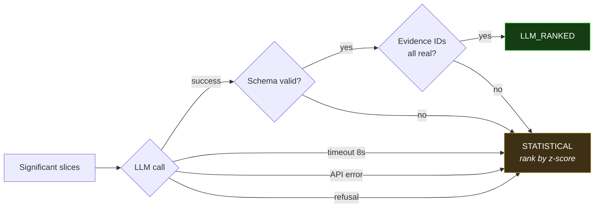
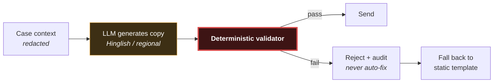

# AI Design — Where the Model Belongs, and Where It Does Not

| Field | Value |
|---|---|
| Document version | 1.0 |
| Status | Approved for build |
| Provider | Anthropic Claude (`anthropic` Python SDK) |
| Related | [ARCHITECTURE](ARCHITECTURE.md) · [POLICY-ENGINE](POLICY-ENGINE.md) · [METRICS](../01-product/METRICS-AND-KPIS.md) |

The buildathon scores "AI judgment: the right tool in the right place, **and where
you chose not to use one**." This document is the answer to the second half.

---

## 1. The decision table

Every stage of the pipeline, with an explicit ruling.

| # | Stage | AI? | Reasoning |
|---|---|:--:|---|
| 1 | Webhook ingestion, HMAC verification | ❌ | Cryptography. There is no judgment here. |
| 2 | Decline-code normalisation | ❌ | A lookup table. A model would introduce variance into a mapping that must be stable, and the mapping is auditable as data. |
| 3 | Leak detection (L1–L5) | ❌ | Threshold comparisons on structured fields. Must be reproducible, must run on every event, must cost nothing. |
| 4 | Degradation detection (L6) | ❌ | CUSUM/EWMA change detection. A calibrated statistical method with known false-positive characteristics beats a model with unknown ones. |
| 5 | Slice aggregation | ❌ | SQL `GROUP BY`. The numbers must be exactly right, and an LLM computing arithmetic over thousands of rows is both slower and wrong. |
| 6 | Significance testing | ❌ | Two-proportion z-test. A closed-form calculation. |
| 7 | **Hypothesis ranking and narration** | ✅ | **Genuine judgment**: given several statistically significant slices, which is the *cause* rather than a correlate? Requires payments domain reasoning over ambiguous evidence. |
| 8 | Playbook selection for known root causes | ❌ | A dictionary from root cause to playbook. Deterministic and reviewable. |
| 9 | **Playbook proposal for unseen decline codes** | ✅ | A novel failure code has no mapping. A model can reason from the code's semantics to a sensible strategy — which is then reviewed by a human before it enters the registry. |
| 10 | Retry timing | ❌ | A contextual bandit. "When should I retry" is a calibrated-probability question, not a language question. |
| 11 | Channel selection | ❌ | Bandit over channels, constrained by cost and consent. |
| 12 | **Customer message copy** | ✅ | Hinglish and regional-language personalisation across thousands of variants. Templates cannot cover the space; this is what language models are actually for. |
| 13 | Message compliance validation | ❌ | **Never.** "Is this legal to send" must not have a temperature parameter. |
| 14 | Policy gate | ❌ | **Never.** Structurally enforced — see §6. |
| 15 | Action execution | ❌ | Idempotent side effects. |
| 16 | Payment attribution | ❌ | Deterministic matching. Every recovery number depends on this being exact. |
| 17 | Outcome classification | ❌ | A state machine. |
| 18 | **Benchmark report narration** | ✅ | Summarising a report for a human reader. Display-only, never parsed. |

**Four uses out of eighteen stages.** None of them sits between a decision and
money moving.

## 2. The load-bearing principle

> The model contributes **quality**. It never contributes **correctness**.

Concretely: if every Claude call failed right now, Recoup would still detect,
diagnose (by significance ranking), plan, gate, execute, attribute, and report.
Diagnosis accuracy would drop and the copy would revert to templates. Nothing
would break, no case would stall, no money would move incorrectly.

This is verified, not asserted. `make test-no-llm` runs the entire suite with the
LLM client replaced by one that raises on every call. **The suite must pass.**
That test is the real statement of this architecture.

## 3. Use 1 — Hypothesis ranking

### 3.1 The problem it solves

The slicer finds that a batch of failures over-indexes on:

- Issuer `HDFC` — failure rate 31% vs 4% baseline, z = 4.8, p < 0.001
- BIN range `456789` — 29% vs 5%, z = 4.1, p < 0.001
- PSP route `route_a` — 22% vs 6%, z = 3.2, p = 0.001
- Instrument `card` — 18% vs 7%, z = 2.9, p = 0.004

All four are significant. **They are also not independent** — that BIN range
belongs to that issuer, whose cards route through `route_a`. Ranking by z-score
alone reports four findings when there is one cause.

Deciding that "the issuer is down and the other three are downstream artefacts of
that" requires knowing how Indian payment infrastructure is wired. That is domain
reasoning over ambiguous evidence, and it is the one place in this pipeline where
a model is genuinely the right instrument.

### 3.2 The contract

```python
class Hypothesis(BaseModel):
    root_cause: RootCause          # closed enum — model cannot invent one
    confidence: float = Field(ge=0.0, le=1.0)
    primary_evidence_ids: list[str]
    subsumes: list[str] = []       # slices explained as downstream of this one
    narration: str = Field(max_length=600)

class RankedDiagnosis(BaseModel):
    hypotheses: list[Hypothesis] = Field(min_length=1, max_length=3)
    abstain: bool = False
    abstain_reason: str | None = None
```

Enforced with the SDK's structured-output helper, which validates the response
against the schema:

```python
response = client.messages.parse(
    model="claude-opus-5",
    max_tokens=4096,
    thinking={"type": "adaptive"},
    output_config={"effort": "medium"},
    system=DIAGNOSIS_SYSTEM_PROMPT,      # frozen, cached
    messages=[{"role": "user", "content": render_evidence(slices)}],
    output_format=RankedDiagnosis,
)
diagnosis = response.parsed_output       # validated RankedDiagnosis
```

Three guardrails in the schema itself:

- `root_cause` is a **closed enum**. The model selects from the taxonomy in
  [DOMAIN-MODEL](DOMAIN-MODEL.md); it cannot invent a category that has no
  playbook.
- `primary_evidence_ids` must reference slices we actually computed. A hypothesis
  citing evidence that does not exist is rejected — this is the hallucination
  check, and it is a set-membership test rather than a vibe.
- `abstain: true` is a first-class, encouraged output. "The statistics do not
  support a confident diagnosis" is a correct answer and is measured as the
  abstention rate.

### 3.3 What the model is *not* given

The redaction layer sits between the slicer and the client and asserts on its
own output:

| Withheld | Why |
|---|---|
| Customer names, phones, emails, addresses | No business need. PII in a prompt is PII in a third party's logs. |
| Payment IDs, order IDs, card numbers, VPAs | Identifiers enable re-identification and buy nothing for ranking. |
| Raw transaction rows | The model ranks pre-computed statistics. Rows would invite it to compute. |
| The at-risk amount of any individual case | Diagnosis is about cause, not value. Value belongs to the policy engine. |

The redactor has its own test suite asserting that no field matching a PII
pattern survives, and it runs on **every** payload, in production and in tests.
NFR-9 is "zero PII to the LLM" and it is enforced by code, not by careful
prompting.

### 3.4 Fallback



Every fallback increments `recoup_llm_schema_failures_total` and records
`fallback_reason` on the diagnosis. **The benchmark reports the fallback rate**,
because a system whose LLM path silently fails 40% of the time while claiming to
be AI-powered is misrepresenting itself.

Timeout is 8 seconds. Diagnosis is not on the customer's critical path, but a
case stuck waiting on a model is a case not being recovered.

## 4. Use 2 — Copy generation, and why it is safe

The riskiest use of an LLM in this system: text sent to real people about money
they owe. It is made safe by a hard split.



**Generation is a judgment problem. Approval is not.** The model writes; the
validator decides. A rejected message is never silently rewritten and resent —
that would make the check theatre. It falls back to a static registered template.

The validator checks DLT template conformance, opt-out presence, prohibited
language (`"legal action"`, `"CIBIL"`, `"recovery agent"`, and Hinglish
equivalents), exact amount match against `case.at_risk`, link integrity, and
encoding-aware length. Full list in [POLICY-ENGINE §5](POLICY-ENGINE.md).

The amount check deserves emphasis: **any rupee figure in generated copy must
equal the case's at-risk amount exactly.** A model that writes ₹2,499 when the
case is ₹2,490 has produced a misrepresentation, and no amount of prompt
engineering makes that a risk worth accepting when a string comparison eliminates it.

## 5. Use 3 — Novel decline codes (human-in-the-loop)

When a decline code appears that has no taxonomy mapping, the system does **not**
guess and act. It:

1. Maps it to `UNKNOWN`, which is non-retryable and escalates. (Conservative
   default — an unmapped code is a gap in our knowledge, not a licence to try
   things on a customer.)
2. Asks the model to propose a category and playbook, with reasoning.
3. Files the proposal in a review queue.
4. A human approves it into the registry, as a reviewed commit.

The model's output is **a pull request, not a decision.** This is the pattern for
letting a model extend the system without letting it change behaviour at runtime.

## 6. Structural enforcement

These are architecture, not policy documents. CI fails on violation.

### 6.1 The policy engine cannot import a model

```toml
[[tool.importlinter.contracts]]
name = "Policy engine is model-free"
type = "forbidden"
source_modules = ["recoup.policy"]
forbidden_modules = ["anthropic", "recoup.diagnosis.ranker", "recoup.llm"]
unmatched_ignore_imports_alias = "error"
```

The central product promise — *no model can influence whether an action is
permitted* — is enforced by a linter, so it cannot decay through a well-meaning
refactor.

### 6.2 Narration is never parsed

`Hypothesis.narration` and the report narration are display-only. A grep-based
test asserts no branch anywhere reads them:

```python
def test_narration_never_drives_control_flow():
    """Model prose must not influence behaviour."""
    for path in (SRC / "planning").rglob("*.py"):
        assert ".narration" not in path.read_text(), (
            f"{path} reads narration — model prose must not drive control flow"
        )
```

If narration were load-bearing, upgrading the model would become a behaviour
change requiring full revalidation. Keeping it inert means the model is a
component we can swap.

### 6.3 The whole system runs without the model

```bash
make test-no-llm    # LLM client raises on every call; full suite must pass
```

## 7. Model selection

Current pricing, per million tokens:

| Model | ID | Input | Output | Context |
|---|---|---|---|---|
| Claude Opus 5 | `claude-opus-5` | $5.00 | $25.00 | 1M |
| Claude Sonnet 5 | `claude-sonnet-5` | $2.00 | $10.00 | 1M |
| Claude Haiku 4.5 | `claude-haiku-4-5` | $1.00 | $5.00 | 200K |

**Default: `claude-opus-5` for every call site.** Diagnosis is the reasoning task
this product's credibility rests on, and the payments-infrastructure inference in
§3.1 — recognising that a BIN slice is downstream of an issuer slice — is exactly
the kind of judgment where capability shows.

The prompts are small (a few thousand tokens of aggregated statistics), so the
absolute spend is low regardless of tier. A 2,000-case benchmark with diagnosis
batched by cohort runs on the order of a few hundred model calls, not thousands —
because **diagnosis is per cohort, not per case** (§8.1).

Model choice is a configuration value, and the ablation harness (§9) measures
accuracy, latency, and cost across tiers so the choice is evidence-based rather
than assumed. Moving to a cheaper tier is a decision to make **after** seeing that
data, not before.

### 7.1 API specifics

- **Adaptive thinking** (`thinking={"type": "adaptive"}`) on diagnosis calls.
  Ranking correlated slices benefits from reasoning; `budget_tokens` is not a
  parameter on current models.
- **Effort** via `output_config={"effort": "medium"}` for diagnosis, `"low"` for
  copy generation. Copy is a short generation task and does not repay deep thought.
- **No assistant prefill.** Rejected on current models; structured outputs handle
  format control.
- **Refusal fallbacks** enabled on Opus 5 call sites
  (`betas=["server-side-fallback-2026-07-01"]`, `fallbacks="default"`), so a
  safety decline routes rather than stalls a case. Recoup discusses debt
  collection, which is a domain where a classifier could plausibly decline; the
  local fallback in §3.4 also covers it.
- **Batch API** for benchmark runs — non-latency-sensitive, **50% cost**.

## 8. Cost and caching

### 8.1 Diagnosis is per cohort, not per case

The single most consequential design decision for cost. Cases sharing a
`(leak_class, decline_category, time_bucket)` key are diagnosed **once**, and the
result is attached to every case in the cohort.

A 2,000-case benchmark produces on the order of 150–250 cohorts. That is a **~10×
reduction** in model calls versus naive per-case diagnosis, and it is also more
correct: diagnosing "is this issuer down" from a single case is statistically
meaningless. The cost saving is a consequence of doing the statistics properly,
not a compromise against it.

### 8.2 Prompt caching

Caching is a prefix match, so the request is ordered stable-first:

```
tools (none) → system (frozen: taxonomy + playbook registry + rules) → messages (volatile: this cohort's stats)
```

The system prompt carries the decline taxonomy, playbook registry, and ranking
rules — several thousand tokens, byte-identical across every call.

```python
system=[{
    "type": "text",
    "text": DIAGNOSIS_SYSTEM_PROMPT,
    "cache_control": {"type": "ephemeral", "ttl": "1h"},
}]
```

The 1-hour TTL is chosen for the benchmark's shape: a full run makes hundreds of
calls over several minutes, so a 5-minute TTL would expire mid-run during slower
stages.

**Silent-invalidator discipline.** The system prompt is a module-level constant
with no interpolation. No timestamp, no run ID, no `datetime.now()`. Playbook
registry rendering uses sorted keys, because an unsorted `dict` iteration changes
byte order between runs and silently destroys the cache. A test asserts the
rendered prompt is byte-identical across two independent constructions:

```python
def test_system_prompt_is_byte_stable():
    assert build_diagnosis_prompt() == build_diagnosis_prompt()
```

Cache effectiveness is verified rather than assumed — `recoup_llm_cache_read_tokens`
is exported, and a run where `cache_read_input_tokens` stays at zero across
hundreds of calls means an invalidator crept in.

## 9. The ablation — does the model earn its place?

Every benchmark run answers this, and the answer ships in the report.

| Configuration | Top-1 accuracy | Abstention | Cost | p95 latency |
|---|---|---|---|---|
| `statistical` — rank by z-score, no model | — | — | ₹0 | ~5 ms |
| `llm_ranked` — Claude Opus 5 | — | — | ₹— | ~1.2 s |
| `llm_ranked` — Claude Sonnet 5 | — | — | ₹— | ~0.8 s |

Run with `make bench ABLATION=1`.

**If the LLM does not beat statistical ranking by a margin justifying its cost and
latency, the honest conclusion is to remove it, and the report will say so.** The
architecture supports running entirely without it (§2, §6.3) precisely so this
question can be asked without a rewrite — and so the answer can be "no" without
the project collapsing.

That is what "AI judgment" means here: not using a model everywhere, but building
the measurement that tells you whether the model was worth using at all.

## 10. Prompt injection

Recoup ingests customer-controlled text — names at checkout, SMS replies, support
notes. Assume it is hostile.

| Vector | Defence |
|---|---|
| Malicious text in a customer name field | Never reaches the model — the redactor strips all PII before the diagnosis payload is built |
| Injection via SMS reply | Replies are parsed by a keyword matcher (`STOP`, `PAUSE`, promise-to-pay dates), not a model |
| Model persuaded to recommend an aggressive action | Irrelevant — the model outputs a `root_cause` enum, and the playbook mapping is a dictionary. There is no channel for "recommend an action" |
| Model persuaded to bypass policy | Structurally impossible — the gate cannot import a model (§6.1) |
| Injected text in generated copy | Caught by the deterministic validator's prohibited-language and template-conformance checks |

The adversarial test suite exercises each of these with real injection payloads
and asserts no behaviour change. The strongest defence is architectural: **the
model's output is a constrained enum consumed by a dictionary lookup.** There is
no instruction channel to hijack, because the model was never given the authority
to instruct anything.
