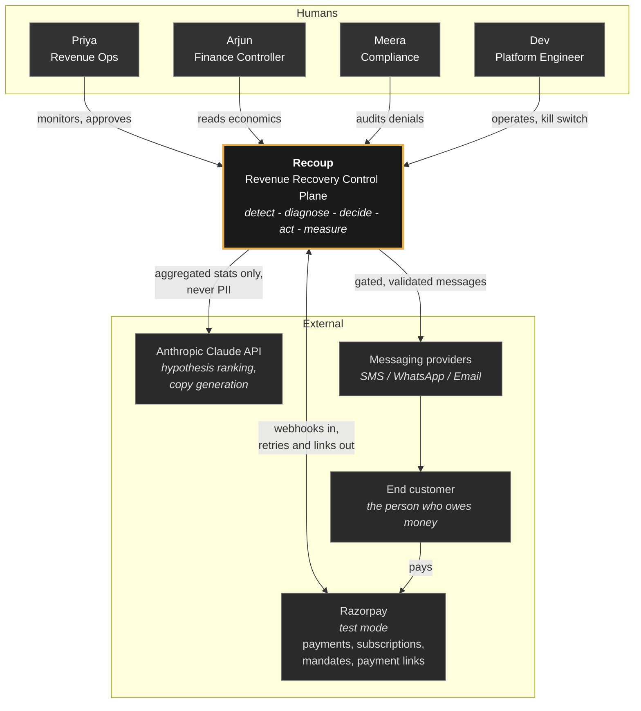
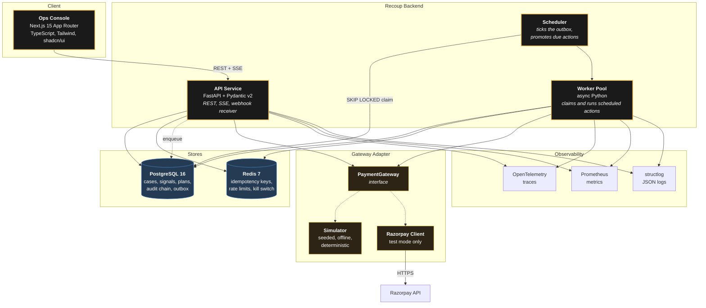
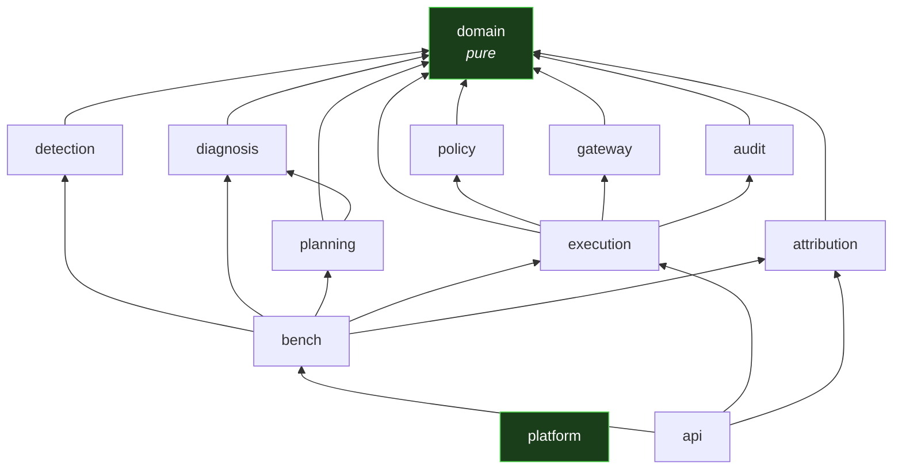
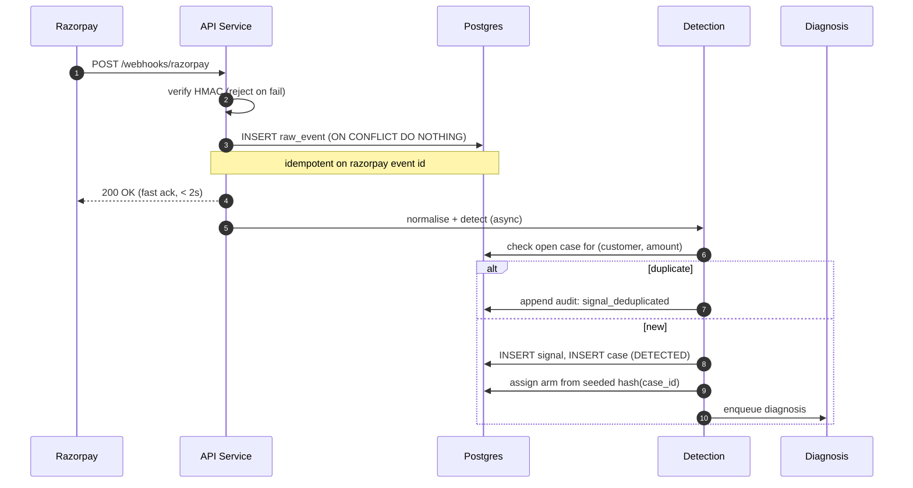
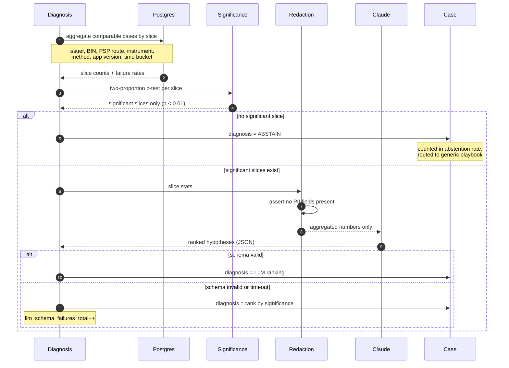
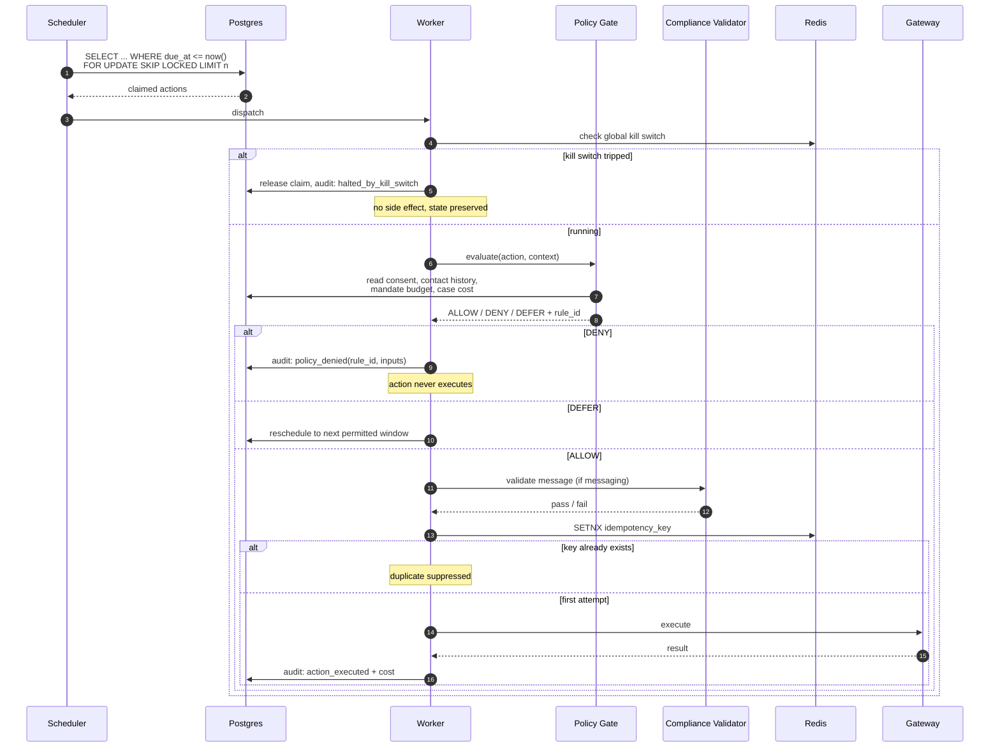
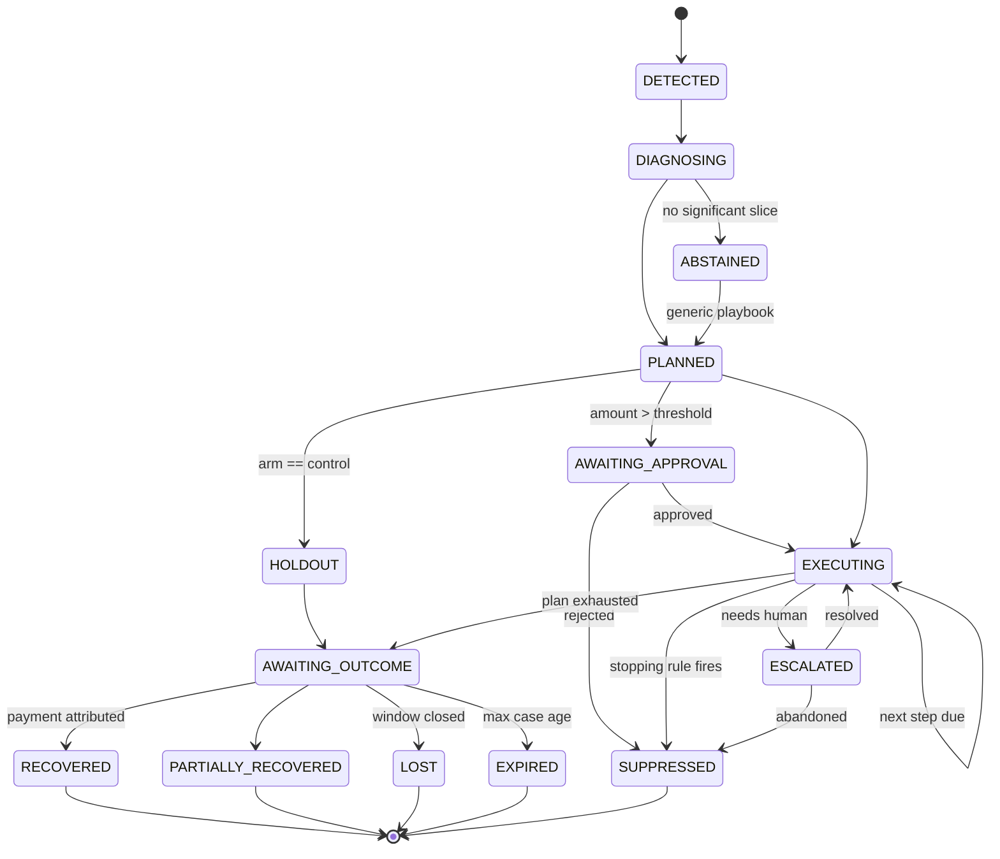
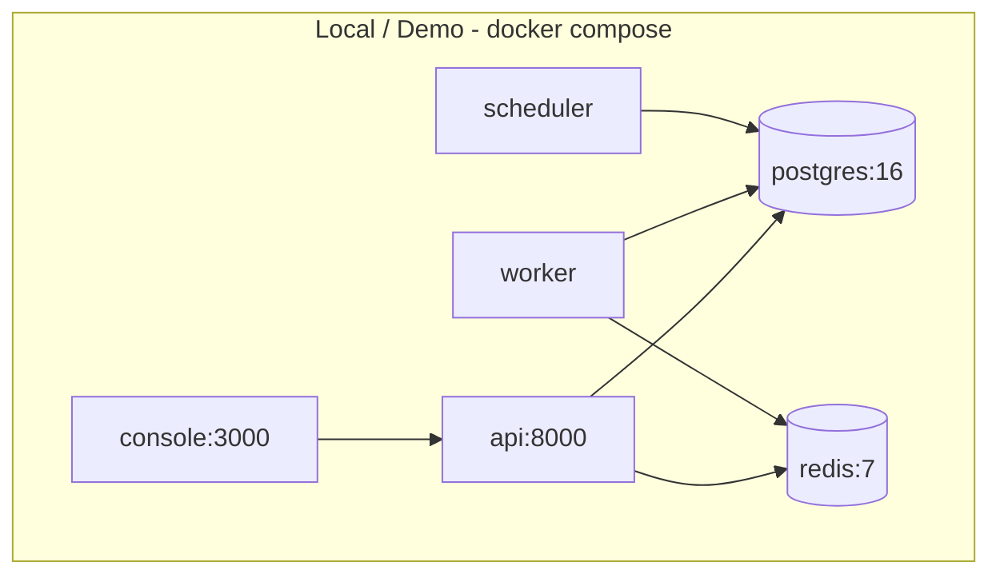

# Architecture — Recoup

| Field | Value |
|---|---|
| Document version | 1.0 |
| Status | Approved for build |
| Related | [TRD](TRD.md) · [DOMAIN-MODEL](DOMAIN-MODEL.md) · [ADRs](../04-adr/) |

Diagrams use Mermaid and render natively on GitHub.

---

## 1. Architectural stance

Recoup is a **control plane**. It decides what should happen to at-risk revenue.
Razorpay is the **data plane** — it is the only thing that actually moves money.
Recoup never holds funds, never settles, and never acts outside Razorpay's APIs.

Four properties drive every structural decision:

| Property | Structural consequence |
|---|---|
| **Every side effect is governed** | A single choke point — the Executor — through which all outbound actions pass, with the Policy Gate immediately upstream of it |
| **Everything is replayable** | Raw events persisted before interpretation; an append-only hash-chained audit log as the system of record |
| **Nothing is lost on crash** | Postgres-backed durable outbox with `FOR UPDATE SKIP LOCKED` claiming, not an in-memory queue |
| **Benchmarks are reproducible** | Gateway behind an interface with a seeded simulator implementation; all randomness derived from one seed |

A deliberate consequence: **the LLM sits outside the critical path.** If every
model call failed, cases would still detect, diagnose (by significance ranking),
plan, gate, execute, and attribute. Quality would drop; correctness would not.

## 2. C4 Level 1 — System context



## 3. C4 Level 2 — Containers



### 3.1 Why these containers

**One API service, not microservices.** At this scale, splitting detection,
diagnosis, and execution into separate deployables would buy nothing and cost
transactional integrity. A case's state transition and its audit event must be
written in one transaction — that is far easier in one process. The module
boundaries are enforced in code (see §5), so extraction later is mechanical.
Recorded as [ADR-0002](../04-adr/ADR-0002-modular-monolith.md).

**Scheduler separate from workers.** The scheduler's job is to promote due
actions from the outbox and hand them off; it is single-purpose and easy to
reason about. Workers are horizontally scalable and stateless.

**Postgres for the queue, not a broker.** Discussed in
[ADR-0003](../04-adr/ADR-0003-postgres-outbox-over-broker.md). Summary: the
outbox is already needed for durability and audit; adding a broker would mean two
sources of truth about whether an action is pending.

## 4. C4 Level 3 — The pipeline

The core is a six-stage pipeline. Each stage has one responsibility and a typed
input and output.

```mermaid
flowchart LR
    EV["Raw Events<br/><i>webhooks, imports</i>"]

    subgraph "1 - Ingestion"
        VER["HMAC verify"]
        RAW["Persist raw"]
        NORM["Normalise<br/>to canonical<br/>decline taxonomy"]
    end

    subgraph "2 - Detection"
        DET["Detectors<br/>L1..L6"]
        DEDUP["Dedupe against<br/>open cases"]
        SIG["Signal"]
    end

    subgraph "3 - Diagnosis"
        SLICE["Slice + aggregate<br/><i>SQL only</i>"]
        TEST["Significance test<br/><i>two-proportion z</i>"]
        RANK["LLM ranks + narrates<br/><i>schema-validated</i>"]
        DX["Diagnosis<br/>+ evidence"]
    end

    subgraph "4 - Planning"
        PB["Select playbook<br/><i>by root cause</i>"]
        TIME["Timing policy<br/><i>contextual bandit</i>"]
        PLAN["Intervention Plan<br/><i>scheduled steps</i>"]
    end

    subgraph "5 - Gate + Execute"
        GATE["<b>Policy Gate</b><br/><i>deterministic</i>"]
        VALID["Compliance<br/>validator"]
        EXEC["Executor<br/><i>idempotent</i>"]
    end

    subgraph "6 - Attribution"
        MATCH["Match inbound<br/>payments"]
        OUT["Outcome"]
    end

    EV --> VER --> RAW --> NORM --> DET --> DEDUP --> SIG
    SIG --> SLICE --> TEST --> RANK --> DX
    DX --> PB --> TIME --> PLAN
    PLAN --> GATE
    GATE -->|ALLOW| VALID --> EXEC
    GATE -->|DENY / DEFER| AUDIT2["Audit only<br/><i>no side effect</i>"]
    EXEC --> MATCH --> OUT

    AUDIT[("Audit chain<br/><i>every stage writes</i>")]
    NORM -.-> AUDIT
    SIG -.-> AUDIT
    DX -.-> AUDIT
    PLAN -.-> AUDIT
    GATE -.-> AUDIT
    EXEC -.-> AUDIT
    OUT -.-> AUDIT

    classDef ai fill:#3d2f14,stroke:#e8b04b,stroke-width:2px,color:#fff
    classDef det fill:#14293d,stroke:#4a90d9,stroke-width:2px,color:#fff
    classDef gate fill:#3d1414,stroke:#d94a4a,stroke-width:3px,color:#fff
    class RANK ai
    class SLICE,TEST,DET,DEDUP,TIME,MATCH det
    class GATE,VALID gate
```



**Legend:** amber = LLM involved · blue = deterministic · red = policy choke point.

Note that amber appears exactly once, and it is downstream of the significance
test and upstream of nothing that touches money.

## 5. Module structure

Enforced by `import-linter` in CI. A violation fails the build.

```
services/core/src/recoup/
├── domain/              # Pure. Entities, value objects, state machines.
│   ├── case.py          #   No I/O. No framework imports. No LLM.
│   ├── signal.py
│   ├── diagnosis.py
│   ├── plan.py
│   ├── action.py
│   ├── outcome.py
│   └── money.py         #   Integer paise. Never float.
│
├── policy/              # Deterministic gate. Depends only on domain.
│   ├── engine.py        #   Evaluate(action, context) -> Decision
│   ├── rules/           #   One file per rule, individually testable
│   └── stopping.py      #   Case-terminating rules
│
├── detection/           # Signal detectors. Depends on domain + repositories.
│   ├── detectors/       #   L1..L6
│   └── changepoint.py   #   CUSUM / EWMA
│
├── diagnosis/           # Slice statistics, significance, LLM ranking.
│   ├── slicer.py        #   SQL aggregation
│   ├── significance.py  #   Hypothesis tests
│   ├── ranker.py        #   LLM call, schema-validated, with fallback
│   └── redaction.py     #   PII stripping before any model call
│
├── planning/            # Playbooks and timing.
│   ├── playbooks/       #   Versioned YAML + loader
│   ├── timing/          #   Contextual bandit, Thompson sampling
│   └── planner.py
│
├── execution/           # The only module permitted outbound side effects.
│   ├── executor.py      #   Asserts an ALLOW exists before acting
│   ├── outbox.py        #   Durable claim/complete
│   ├── channels/        #   sms, whatsapp, email, voice, payment_retry, link
│   └── compliance.py    #   Message validator (deterministic)
│
├── attribution/         # Payment matching, outcome assignment.
│
├── gateway/             # Razorpay abstraction.
│   ├── interface.py     #   Protocol
│   ├── razorpay_client.py
│   └── simulator/       #   Seeded, deterministic
│
├── audit/               # Append-only hash-chained log + verifier.
│
├── bench/               # Cohort generator, arm runner, report writer.
│
├── api/                 # FastAPI. Thin. Depends on everything, owned by nothing.
│
└── platform/            # Config, DB session, telemetry, clock, RNG.
```

### 5.1 Dependency rules



Hard rules, checked in CI:

1. `domain` imports nothing from Recoup except `domain`. No SQLAlchemy, no
   FastAPI, no `anthropic`, no `datetime.now`.
2. Nothing imports `api`.
3. Only `execution` may perform outbound side effects. Any HTTP client
   instantiation outside `execution`, `gateway`, or `diagnosis.ranker` is a
   violation.
4. `policy` must not import `diagnosis`, `planning`, or anything with an LLM
   client in its transitive closure. The gate cannot be model-influenced, and
   this is enforced structurally rather than by convention.

Rule 4 is the architectural expression of the product's central promise.

## 6. Key runtime flows

### 6.1 Webhook to case



The fast ack matters: Razorpay retries webhooks it considers failed, and a slow
handler turns into duplicate delivery. We ack after durable raw write, before
interpretation.

### 6.2 Diagnosis — where the LLM is allowed in



Two guarantees visible here: the model never sees a customer record, and the
model failing degrades quality rather than breaking the pipeline.

### 6.3 Action execution — the choke point



The `SETNX` on Redis plus the durable outbox row gives at-least-once delivery
with effective exactly-once semantics: a crash between gateway call and audit
write is recovered by the idempotency key on retry.

### 6.4 Case state machine



Transitions are enforced in `domain/case.py` as an explicit table. An illegal
transition raises rather than silently corrupting state, and is covered by
property tests asserting every case reaches exactly one terminal state.

## 7. Data architecture

Detail in [DATA-MODEL.md](DATA-MODEL.md). The structurally significant choices:

| Choice | Reason |
|---|---|
| **Money as integer paise**, never float | `0.1 + 0.2 != 0.3`. A rounding error in a recovery system is a correctness bug. Enforced by a `Money` value object with no float constructor. |
| **`raw_events` before interpretation** | Detection logic can be re-run over history when a detector changes. Without it, a detector bug is unrecoverable. |
| **Append-only `audit_events` with `prev_hash`** | The audit log is the system of record. Mutable audit is not audit. |
| **Outbox table, not a broker** | One source of truth for "is this action pending". See ADR-0003. |
| **`consent_ledger` append-only** | Consent state is derived by folding the ledger, so we can answer "was this customer opted in *at the time we contacted them*" — the question compliance actually asks. |
| **Arm assignment stored on the case** | Reproducibility. A benchmark that re-randomises on re-run is not a benchmark. |

## 8. The gateway abstraction

The single most important testability decision.

```python
class PaymentGateway(Protocol):
    async def retry_payment(self, req: RetryRequest) -> PaymentResult: ...
    async def create_payment_link(self, req: LinkRequest) -> PaymentLink: ...
    async def fetch_payment(self, payment_id: str) -> Payment: ...
    async def present_mandate(self, req: MandateDebitRequest) -> DebitResult: ...
    async def fetch_subscription(self, sub_id: str) -> Subscription: ...
```

Two implementations:

| | `RazorpaySimulator` | `RazorpayClient` |
|---|---|---|
| Network | None | HTTPS to test mode |
| Determinism | Total — seeded RNG | None |
| Failure modes | Injected from a configured distribution | Whatever the sandbox does |
| Used by | Benchmarks, tests, `make demo` | Integration suite, live demo |
| Credentials | None | Test-mode keys only |

The simulator is not a mock. It models issuer-level failure correlation, time-of-day
success-rate variation, mandate re-presentation budgets, salary-cycle effects on
`insufficient_funds`, and injected issuer outages — because those are exactly the
phenomena the diagnosis engine claims to detect, and a simulator without them
would let us claim a capability we never tested.

Recorded as [ADR-0004](../04-adr/ADR-0004-simulator-first-gateway.md).

## 9. Deployment



`make demo` brings this up, migrates, seeds a cohort, runs a benchmark, and
prints the report path. No credentials required — the simulator is the default
gateway. Adding `RAZORPAY_KEY_ID` / `RAZORPAY_KEY_SECRET` to `.env` switches the
adapter to live test mode with no other change.

### 9.1 Scaling path (documented, not built)

Honest about what this architecture is not yet:

| Load | What breaks first | Fix |
|---|---|---|
| ~10k cases/day | Nothing | — |
| ~100k cases/day | Scheduler tick contention on the outbox | Partition outbox by `due_at` bucket; multiple scheduler shards |
| ~1M cases/day | Single Postgres write throughput | Split audit chain to its own instance; move outbox to a broker with an idempotency store |
| Multi-region | Clock skew in attribution windows | Anchor attribution to gateway-reported timestamps only |

Temporal was considered for durable workflow execution and rejected for this
scale — the reasoning, and the threshold at which it becomes correct, is in
[ADR-0003](../04-adr/ADR-0003-postgres-outbox-over-broker.md).

## 10. Technology choices

| Layer | Choice | Why this and not the obvious alternative |
|---|---|---|
| Core language | Python 3.12 | The diagnosis layer is statistics and the timing policy is a bandit. Doing that in TypeScript means reimplementing scipy. |
| API | FastAPI + Pydantic v2 | Pydantic models are the domain contract *and* the OpenAPI spec *and* the LLM response schema. One definition, three uses. |
| ORM | SQLAlchemy 2.0 async | Mature async support; `FOR UPDATE SKIP LOCKED` expressible without raw SQL escape hatches everywhere. |
| Migrations | Alembic | Autogenerate with review. Every migration reviewed by hand; autogenerate is a draft, not an answer. |
| DB | PostgreSQL 16 | Needs transactional integrity between state change and audit write. Also `SKIP LOCKED`, partial indexes, and `jsonb` for evidence blobs. |
| Cache/locks | Redis 7 | Idempotency keys and kill switch need sub-ms reads and TTLs. |
| Package manager | uv | Fast, lockfile-first, reproducible. |
| LLM | Anthropic Claude | Schema-constrained tool use for hypothesis ranking; strong at Indian-language copy. Model selection in [AI-DESIGN](AI-DESIGN.md). |
| Console | Next.js 15 App Router | Server components mean the case timeline renders without a client-side data layer. |
| UI kit | shadcn/ui + Tailwind | Ships in hours, looks credible, no design-system time sink. |
| Tests | pytest + hypothesis + testcontainers | Hypothesis for policy invariants — the properties matter more than the examples. |
| Types | mypy strict, tsc strict | Non-negotiable in a money path. |
| Telemetry | OpenTelemetry + Prometheus + structlog | Vendor-neutral; every audit event carries the trace ID. |

## 11. Where this architecture could be wrong

Stated plainly, because pretending otherwise is worse.

- **The modular monolith bet.** If the diagnosis layer turns out to need very
  different scaling than execution, the single deployable becomes a constraint.
  Mitigated by strict import boundaries, so extraction is mechanical rather than
  a rewrite. Confidence: high that this is right at this scale.
- **The bandit may not have enough data.** Contextual bandits need volume to
  beat a well-chosen fixed schedule. On a 2,000-case benchmark, the bandit could
  plausibly lose to the baseline. Mitigation is warm-starting from generator
  priors and reporting calibration honestly — and if it loses, the report says it
  lost. Confidence: medium.
- **Simulator realism bounds every claim.** The results are only as meaningful as
  the generator's failure distributions. This is why the comparison is internal
  (treatment vs baseline vs control on the *same* generator) rather than a claim
  about absolute real-world recovery rates. Confidence: the internal comparison is
  valid; absolute numbers are not claimed.
- **72-hour attribution window is a judgment call.** Too short and we undercount;
  too long and we credit coincidence. Chosen conservatively (undercounting), and
  sensitivity across 24h/72h/7d windows is reported so the choice is visible
  rather than buried.
