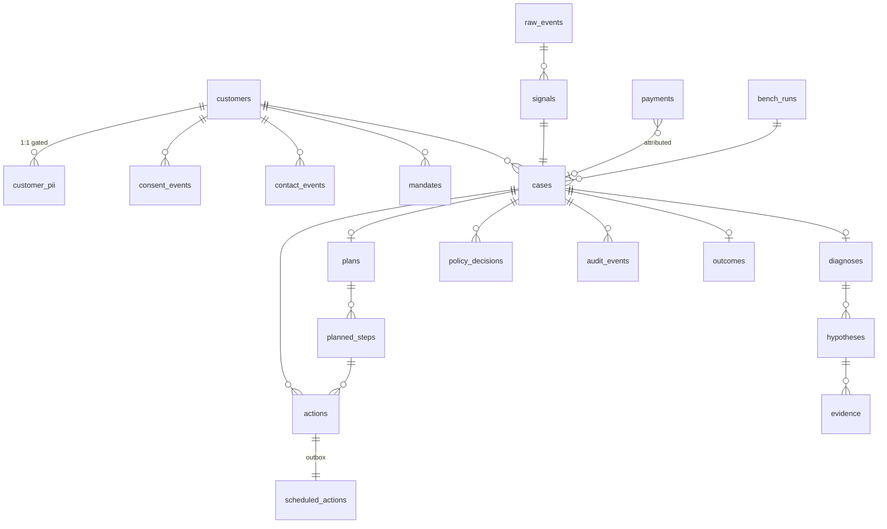

# Data Model

| Field | Value |
|---|---|
| Document version | 1.0 |
| Database | PostgreSQL 16 |
| Related | [DOMAIN-MODEL](DOMAIN-MODEL.md) · [SECURITY](SECURITY.md) |

Schema-level decisions and the constraints that enforce domain invariants in the
database rather than only in application code.

---

## 1. Conventions

| Rule | Rationale |
|---|---|
| `id` is `uuid` (v7), generated by the application | v7 is time-sortable, so index locality is good without exposing a sequence count |
| Money columns are `bigint`, named `*_paise` | Integer minor units. `numeric` would work; `bigint` makes an accidental float insert a type error |
| Timestamps are `timestamptz`, always UTC | Naive timestamps in a system reasoning about quiet hours across timezones is a bug generator |
| Enums are `text` + `CHECK`, not PG `enum` | Adding a value to a PG enum is a migration with a lock; a CHECK constraint is a cheap swap |
| Every table has `created_at` | Non-negotiable for forensics |
| Mutable tables have `updated_at` (trigger) | Append-only tables deliberately lack it |
| FKs are `ON DELETE RESTRICT` | Nothing in this system should cascade-delete. Deleting a case with an audit trail is not a thing we permit |

## 2. Schema overview



## 3. Tables that carry an invariant

Most tables are unremarkable. These four encode a domain guarantee in the
database, and are worth reading.

### 3.1 `audit_events` — append-only, hash-chained

```sql
CREATE TABLE audit_events (
    id          uuid PRIMARY KEY,
    case_id     uuid NOT NULL REFERENCES cases(id) ON DELETE RESTRICT,
    seq         integer NOT NULL,
    kind        text NOT NULL,
    payload     jsonb NOT NULL,          -- PII masked at write time
    actor_type  text NOT NULL CHECK (actor_type IN ('system','user','scheduler')),
    actor_id    text,
    trace_id    text NOT NULL,
    occurred_at timestamptz NOT NULL,
    prev_hash   text NOT NULL,
    hash        text NOT NULL,
    CONSTRAINT audit_seq_unique UNIQUE (case_id, seq),
    CONSTRAINT audit_seq_positive CHECK (seq >= 1)
);

CREATE INDEX audit_case_seq ON audit_events (case_id, seq);
CREATE INDEX audit_kind_time ON audit_events (kind, occurred_at DESC);

-- Immutability enforced by the database, not by convention.
CREATE OR REPLACE FUNCTION reject_audit_mutation() RETURNS trigger AS $$
BEGIN
    RAISE EXCEPTION 'audit_events is append-only (attempted %)', TG_OP;
END;
$$ LANGUAGE plpgsql;

CREATE TRIGGER audit_no_update BEFORE UPDATE ON audit_events
    FOR EACH ROW EXECUTE FUNCTION reject_audit_mutation();
CREATE TRIGGER audit_no_delete BEFORE DELETE ON audit_events
    FOR EACH ROW EXECUTE FUNCTION reject_audit_mutation();
```

**Why a trigger and not application discipline.** Application-level immutability
is a promise that survives exactly until someone writes a cleanup script. The
audit log is the system of record for every money action; it should be impossible
to modify through *any* path, including `psql`. The trigger makes tampering
require a schema change, which is itself in version control.

`UNIQUE (case_id, seq)` gives gaplessness a home: a concurrent double-write fails
rather than silently forking the chain.

### 3.2 `cases` — deduplication and holdout integrity

```sql
CREATE TABLE cases (
    id             uuid PRIMARY KEY,
    signal_id      uuid NOT NULL REFERENCES signals(id),
    customer_id    uuid NOT NULL REFERENCES customers(id),
    state          text NOT NULL,
    arm            text NOT NULL CHECK (arm IN ('control','baseline','treatment')),
    at_risk_paise  bigint NOT NULL CHECK (at_risk_paise > 0),
    cost_spent_paise   bigint NOT NULL DEFAULT 0 CHECK (cost_spent_paise >= 0),
    cost_ceiling_paise bigint NOT NULL CHECK (cost_ceiling_paise >= 0),
    playbook_id      text,
    playbook_version integer,
    bench_run_id   uuid REFERENCES bench_runs(id),
    opened_at      timestamptz NOT NULL,
    resolved_at    timestamptz,
    created_at     timestamptz NOT NULL DEFAULT now(),
    updated_at     timestamptz NOT NULL DEFAULT now(),

    CONSTRAINT cost_within_ceiling CHECK (cost_spent_paise <= cost_ceiling_paise),
    CONSTRAINT resolved_iff_terminal CHECK (
        (state IN ('recovered','partially_recovered','lost','expired','suppressed')
         AND resolved_at IS NOT NULL)
        OR
        (state NOT IN ('recovered','partially_recovered','lost','expired','suppressed')
         AND resolved_at IS NULL)
    )
);

-- Deduplication: one open case per (customer, amount). FR-7.
CREATE UNIQUE INDEX cases_open_dedup
    ON cases (customer_id, at_risk_paise)
    WHERE state NOT IN ('recovered','partially_recovered','lost','expired','suppressed');
```

Three invariants pushed into the database:

- **`cost_within_ceiling`** is domain invariant I2. A concurrent double-spend that
  slips past the policy engine still fails at commit. Defence in depth on the
  guardrail that protects the merchant's money.
- **`resolved_iff_terminal`** makes "terminal state without a resolution
  timestamp" unrepresentable — a class of reporting bug eliminated rather than
  tested for.
- **`cases_open_dedup`** is a *partial* unique index, so a customer may have many
  historical cases at the same amount but only one open. This is deduplication
  expressed exactly.

### 3.3 `scheduled_actions` — the durable outbox

```sql
CREATE TABLE scheduled_actions (
    id            uuid PRIMARY KEY,
    action_id     uuid NOT NULL REFERENCES actions(id),
    case_id       uuid NOT NULL REFERENCES cases(id),
    due_at        timestamptz NOT NULL,
    status        text NOT NULL DEFAULT 'pending'
                  CHECK (status IN ('pending','claimed','done','failed','cancelled')),
    claimed_by    text,
    claimed_at    timestamptz,
    claim_expires_at timestamptz,
    attempts      integer NOT NULL DEFAULT 0,
    last_error    text,
    created_at    timestamptz NOT NULL DEFAULT now()
);

-- Partial index: the scheduler only ever scans pending work.
CREATE INDEX scheduled_due ON scheduled_actions (due_at)
    WHERE status = 'pending';

-- Reclaiming orphaned claims after a worker dies.
CREATE INDEX scheduled_expired_claims ON scheduled_actions (claim_expires_at)
    WHERE status = 'claimed';
```

Claiming:

```sql
UPDATE scheduled_actions SET
    status = 'claimed', claimed_by = :worker,
    claimed_at = now(), claim_expires_at = now() + interval '5 minutes',
    attempts = attempts + 1
WHERE id IN (
    SELECT id FROM scheduled_actions
    WHERE status = 'pending' AND due_at <= now()
    ORDER BY due_at
    FOR UPDATE SKIP LOCKED
    LIMIT :batch
)
RETURNING *;
```

`SKIP LOCKED` lets many workers claim disjoint batches without blocking each
other. The `claim_expires_at` TTL is what makes a worker crash recoverable
(TR-56): an expired claim returns to `pending`, and the derived idempotency key
prevents the reclaim from producing a second side effect (TR-57).

### 3.4 `consent_events` — append-only ledger

```sql
CREATE TABLE consent_events (
    id          uuid PRIMARY KEY,
    customer_id uuid NOT NULL REFERENCES customers(id),
    channel     text NOT NULL,
    granted     boolean NOT NULL,
    source      text NOT NULL
                CHECK (source IN ('checkout','sms_stop','dashboard','dnd_sync','import')),
    occurred_at timestamptz NOT NULL,
    created_at  timestamptz NOT NULL DEFAULT now()
);

CREATE INDEX consent_lookup
    ON consent_events (customer_id, channel, occurred_at DESC);
```

There is deliberately **no `customers.sms_consent` boolean**. Consent is folded
from this ledger at a point in time, because the question compliance asks is
"were they opted in *when you contacted them*", and a mutable boolean cannot
answer it after the fact.

The index is ordered to serve exactly that query: latest event for a customer and
channel at or before a timestamp.

## 4. PII isolation

```sql
CREATE TABLE customers (
    id            uuid PRIMARY KEY,
    razorpay_customer_id text UNIQUE,
    contact_hash  text NOT NULL,          -- sha256(E.164 phone) — dedup without storage
    timezone      text NOT NULL DEFAULT 'Asia/Kolkata',
    created_at    timestamptz NOT NULL DEFAULT now()
);

CREATE TABLE customer_pii (
    customer_id uuid PRIMARY KEY REFERENCES customers(id) ON DELETE RESTRICT,
    name_enc    bytea,
    phone_enc   bytea,
    email_enc   bytea,
    key_version integer NOT NULL
);
```

The split is what makes NFR-9 ("zero PII to the LLM") structurally true rather
than carefully maintained. The pipeline joins `customers`; only the messaging
channel adapter reaches `customer_pii`, through an access-logged repository.
A developer cannot leak a phone number by logging a domain object, because the
domain object does not contain one.

`contact_hash` allows frequency-cap counting and dedup across cases without
holding the number in a queryable column.

## 5. Read models

Two materialised views, refreshed on a schedule, because the console's dashboard
queries would otherwise aggregate the full case table on every page load:

- **`mv_daily_leak_summary`** — at-risk, recovered, and case counts by day, leak
  class, and arm.
- **`mv_policy_denial_summary`** — denial counts by rule and day, powering the
  compliance view.

Both carry a `refreshed_at` column that the console displays, so a stale
dashboard is visibly stale rather than quietly wrong.

## 6. Migrations

- Alembic, one migration per PR, hand-reviewed. Autogenerate produces a draft;
  the draft is edited (it reliably misses CHECK constraints, partial indexes, and
  triggers — every interesting thing in §3).
- **Expand/contract** for anything backward-incompatible: add nullable, backfill,
  make non-null, drop old. Never a single destructive step.
- Every migration has a tested `downgrade`. A migration that cannot be reversed
  is a migration that cannot be deployed with confidence.
- Data migrations are separate from schema migrations, and are idempotent.

## 7. Retention

| Data | Retention | Reason |
|---|---|---|
| `raw_events` | 90 days | Enables detector re-runs; beyond that the value decays |
| `audit_events` | **Indefinite** | System of record. Never deleted. |
| `customer_pii` | Until erasure request | Deleted on request; the audit trail survives with masked references, so history stays verifiable without holding the data |
| `consent_events` | **Indefinite** | Proving consent state at a past moment requires the full history |
| Benchmark runs | Indefinite | Reproducibility of published results |

The PII erasure path is worth noting: erasing `customer_pii` does **not** break
the audit chain, because audit payloads store masked values and `customer_id`
references. History remains verifiable after the personal data is gone — which is
the property that makes an immutable audit log and a right-to-erasure obligation
compatible rather than contradictory.
