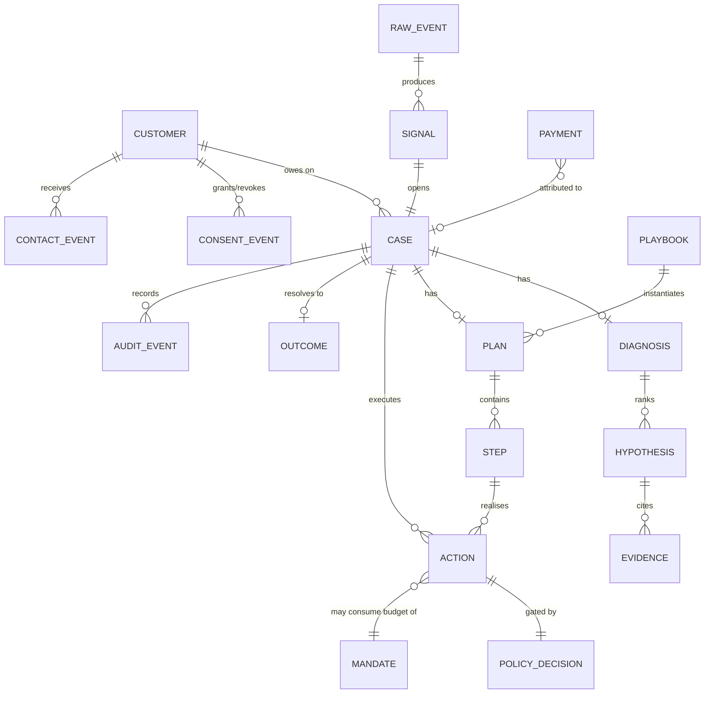

# Domain Model — Recoup

| Field | Value |
|---|---|
| Document version | 1.0 |
| Status | Approved for build |
| Related | [ARCHITECTURE](ARCHITECTURE.md) · [DATA-MODEL](DATA-MODEL.md) · [POLICY-ENGINE](POLICY-ENGINE.md) |

The `domain` package is pure: no I/O, no framework imports, no clock access, no
randomness. Everything here is expressible as a function of its inputs, which is
what makes the pipeline replayable.

---

## 1. Entity map



## 2. Value objects

### 2.1 Money — the one that must not be wrong

```python
@dataclass(frozen=True, slots=True)
class Money:
    paise: int          # integer minor units, always
    currency: Currency = Currency.INR
```

**Invariants, enforced in the constructor:**

- Constructed from `int` paise or a `Decimal` string. There is **no float
  constructor** — `Money(2499.99)` raises `TypeError`.
- Arithmetic across currencies raises. No implicit conversion, ever.
- Division returns an explicit allocation, not a rounded quotient:
  `Money(100).allocate([1, 1, 1])` returns `[34, 33, 33]` paise, summing exactly
  to the original. Remainder distribution is deterministic (largest-remainder,
  then index order).
- Serialises as `{"paise": 249999, "currency": "INR"}`, never as a decimal string,
  so no precision is lost at an API boundary.

Rationale: floats in a money path are a correctness bug waiting for a demo.
`0.1 + 0.2 == 0.30000000000000004` is enough reason on its own; the deeper reason
is that once a float enters, every downstream sum inherits the error and the
benchmark's headline number becomes indefensible.

### 2.2 CustomerRef

An opaque reference, never a raw identifier in logs.

```python
@dataclass(frozen=True, slots=True)
class CustomerRef:
    id: str                    # internal UUID
    razorpay_customer_id: str | None
    contact_hash: str          # SHA-256 of E.164 phone, for dedup without storing
```

PII (phone, email, name) lives in a separate `customer_pii` table behind an
access-logged repository. `CustomerRef` is what flows through the pipeline, which
means an accidental log of a domain object cannot leak a phone number.

### 2.3 DeclineCode — the canonical taxonomy

Razorpay, UPI, NACH, and card networks all return different failure strings for
the same underlying condition. Detection and diagnosis operate on a normalised
taxonomy, and the raw string is preserved on the event for forensics.

```python
class DeclineCategory(StrEnum):
    INSUFFICIENT_FUNDS  = "insufficient_funds"
    ISSUER_DOWN         = "issuer_down"
    ISSUER_DECLINED     = "issuer_declined"
    NETWORK_TIMEOUT     = "network_timeout"
    INVALID_INSTRUMENT  = "invalid_instrument"
    EXPIRED_INSTRUMENT  = "expired_instrument"
    MANDATE_REVOKED     = "mandate_revoked"
    MANDATE_EXHAUSTED   = "mandate_exhausted"
    MANDATE_AMOUNT_EXCEEDED = "mandate_amount_exceeded"
    LIMIT_EXCEEDED      = "limit_exceeded"
    AUTHENTICATION_FAILED = "authentication_failed"
    RISK_BLOCKED        = "risk_blocked"
    CUSTOMER_ABANDONED  = "customer_abandoned"
    UNKNOWN             = "unknown"
```

Each category carries three static properties that drive everything downstream:

| Category | `retryable` | `customer_action_required` | `retry_horizon` |
|---|---|---|---|
| `insufficient_funds` | yes | no | days — align to salary cycle |
| `issuer_down` | yes | no | hours — wait for recovery |
| `issuer_declined` | weakly | maybe | days |
| `network_timeout` | yes | no | minutes |
| `invalid_instrument` | **no** | **yes** | n/a — needs new instrument |
| `expired_instrument` | **no** | **yes** | n/a |
| `mandate_revoked` | **no** | **yes** | n/a — needs re-authorisation |
| `mandate_exhausted` | **no** | no | next cycle |
| `risk_blocked` | **no** | no | **never** — do not retry |
| `customer_abandoned` | n/a | yes | hours |

**`retryable = no` means the executor will refuse a retry action regardless of
what the plan says.** This is the domain layer defending itself against a
planning bug. Retrying an `invalid_instrument` cannot succeed; it only burns
mandate budget and annoys a customer.

`UNKNOWN` is deliberately conservative: not retryable, escalate to human. A
decline code we have not mapped is a gap in our knowledge, not a licence to guess.

## 3. Signal

Immutable. Produced only by deterministic detectors.

```python
@dataclass(frozen=True, slots=True)
class Signal:
    id: SignalId
    leak_class: LeakClass            # L1..L6
    customer: CustomerRef
    at_risk: Money
    detected_at: datetime            # injected clock, never datetime.now()
    source_event_ids: tuple[str, ...]
    decline: DeclineCode | None
    context: SignalContext           # issuer, bin, psp, instrument, method...
```

**Invariants:**
- `at_risk.paise > 0`. A zero-value signal is a detector bug.
- `source_event_ids` is non-empty. Every signal traces to raw events.
- Signals are never mutated or deleted. A retracted signal is superseded by a
  new one referencing it.

## 4. Case — the unit of work

```python
@dataclass
class Case:
    id: CaseId
    signal_id: SignalId
    customer: CustomerRef
    at_risk: Money
    state: CaseState
    arm: Arm                         # control | baseline | treatment
    opened_at: datetime
    diagnosis: Diagnosis | None
    plan: Plan | None
    cost_spent: Money
    cost_ceiling: Money
    terminal_outcome: Outcome | None
```

### 4.1 State machine

Transitions are an explicit table. Anything not in the table raises
`IllegalTransition` — the case does not silently move.

```python
_TRANSITIONS: dict[CaseState, frozenset[CaseState]] = {
    DETECTED:           {DIAGNOSING, SUPPRESSED},
    DIAGNOSING:         {PLANNED, ABSTAINED, SUPPRESSED},
    ABSTAINED:          {PLANNED, SUPPRESSED},
    PLANNED:            {EXECUTING, AWAITING_APPROVAL, HOLDOUT, SUPPRESSED},
    AWAITING_APPROVAL:  {EXECUTING, SUPPRESSED},
    HOLDOUT:            {AWAITING_OUTCOME},
    EXECUTING:          {EXECUTING, AWAITING_OUTCOME, ESCALATED, SUPPRESSED},
    ESCALATED:          {EXECUTING, SUPPRESSED},
    AWAITING_OUTCOME:   {RECOVERED, PARTIALLY_RECOVERED, LOST, EXPIRED},
    # terminal states have no outgoing transitions
}
```

### 4.2 Case invariants

Asserted in code and covered by Hypothesis property tests:

| # | Invariant | Why it matters |
|---|---|---|
| I1 | A case reaches **exactly one** terminal state, exactly once | Double-counting recovery invalidates the benchmark |
| I2 | `cost_spent <= cost_ceiling` at all times | The cost guardrail is meaningless if it can be breached |
| I3 | A case in `HOLDOUT` has **zero** executed actions | Contaminating the control arm invalidates every number in the report |
| I4 | Every state transition writes exactly one audit event | The audit log must be complete, not best-effort |
| I5 | `at_risk` is set once at creation and never modified | Re-estimating at-risk upward would let the system inflate its own denominator |
| I6 | Every executed action has a preceding `ALLOW` decision with the same attempt ID | The policy gate is not bypassable |
| I7 | A case with `arm == control` never leaves `HOLDOUT` for `EXECUTING` | Same as I3, enforced at the transition level too |

I3 and I7 are the same guarantee expressed twice, at the data level and the
transition level. That redundancy is intentional: it is the guarantee the entire
measurement doctrine rests on.

## 5. Diagnosis

```python
@dataclass(frozen=True, slots=True)
class Diagnosis:
    case_id: CaseId
    hypotheses: tuple[Hypothesis, ...]   # ranked, descending confidence
    method: DiagnosisMethod              # STATISTICAL | LLM_RANKED | ABSTAINED
    computed_at: datetime
    llm_model: str | None                # recorded when a model participated
    fallback_reason: str | None          # why we fell back, if we did

    @property
    def root_cause(self) -> RootCause | None:
        return self.hypotheses[0].root_cause if self.hypotheses else None


@dataclass(frozen=True, slots=True)
class Hypothesis:
    root_cause: RootCause
    confidence: float                    # [0, 1]
    evidence: tuple[Evidence, ...]
    narration: str | None                # LLM-written; display only, never parsed


@dataclass(frozen=True, slots=True)
class Evidence:
    slice_dimension: str                 # "issuer" | "bin_range" | "psp_route" | ...
    slice_value: str
    failure_rate: float
    baseline_rate: float
    sample_size: int
    z_statistic: float
    p_value: float
```

**Design decisions worth stating:**

- `narration` is display-only and is **never parsed by code**. Nothing downstream
  branches on model prose. If narration were load-bearing, a model change would
  become a behaviour change.
- `evidence` is computed entirely in SQL before the model is called. The model
  reorders and explains; it does not measure.
- `method` and `fallback_reason` are recorded so the benchmark can report how
  often the LLM path actually ran versus fell back — a number most systems hide.
- `ABSTAINED` is a first-class outcome, not an error. No significant slice means
  we say so and route to a generic playbook.

## 6. Playbook and Plan

### 6.1 Playbook — versioned strategy

Playbooks are YAML, loaded and validated at startup, versioned with the repo.

```yaml
id: insufficient-funds
version: 3
applies_to:
  root_cause: insufficient_funds
  leak_classes: [L1, L2, L3]

cost_ceiling_pct: 4.0        # never spend >4% of at-risk chasing it
max_attempts: 3
max_case_age_days: 21

steps:
  - id: pre_debit_notice
    channel: sms
    timing: { policy: fixed, offset_hours: 0 }
    required: true            # RBI pre-debit notification
    skip_if: { at_risk_below_paise: 50000 }

  - id: timed_retry
    channel: payment_retry
    timing: { policy: bandit, feature_set: salary_cycle_v1 }
    consumes_mandate_budget: true
    guard: { decline_retryable: true }

  - id: payment_link_sms
    channel: sms
    timing: { policy: relative, after_step: timed_retry, offset_hours: 4 }
    payload: { template: recovery_link_v2, requires_dlt: true }

  - id: escalate
    channel: human_review
    timing: { policy: relative, after_step: payment_link_sms, offset_hours: 72 }
    skip_if: { at_risk_below_paise: 500000 }
```

Constraints enforced by the loader:

- A step's `channel` must exist in the channel registry.
- `cost_ceiling_pct` must be > 0 and ≤ 10. A playbook that could spend more than
  10% of the at-risk amount fails to load.
- Steps consuming mandate budget must declare `consumes_mandate_budget: true`,
  so the policy engine can account for it.
- `required: true` steps cannot be skipped by the planner — only by a policy DENY,
  which halts the plan rather than proceeding without them.

### 6.2 Plan — instantiated for one case

```python
@dataclass(frozen=True, slots=True)
class Plan:
    case_id: CaseId
    playbook_id: str
    playbook_version: int
    steps: tuple[PlannedStep, ...]       # ordered, each with a due_at
    total_expected_cost: Money
    created_at: datetime
```

**Invariants:**
- `total_expected_cost <= case.cost_ceiling`. A plan that cannot be afforded is
  never created; the planner drops the lowest-value steps until it fits and
  records what it dropped.
- Every `PlannedStep.step_id` exists in the referenced playbook version. Pinning
  the version means a playbook edit never retroactively changes a running case.
- `due_at` is monotonically non-decreasing across steps.

## 7. Action — the only thing that touches the world

```python
@dataclass(frozen=True, slots=True)
class Action:
    id: ActionId
    case_id: CaseId
    step_id: str
    attempt: int
    channel: Channel
    idempotency_key: str        # sha256(case_id | step_id | attempt)
    payload: ActionPayload
    cost: Money
    due_at: datetime
```

**Invariants:**
- `idempotency_key` is derived, not random. The same logical action recomputed
  after a crash produces the same key, so the duplicate is suppressed.
- An action is executable only with a matching `ALLOW` `PolicyDecision` carrying
  the same `attempt`. Re-using an earlier attempt's ALLOW is rejected — otherwise
  a stale approval could authorise a fresh side effect.
- `cost` is fixed at creation from the cost table and is added to
  `case.cost_spent` in the **same transaction** as the execution record. Cost that
  is tracked separately from execution drifts.

## 8. PolicyDecision

```python
@dataclass(frozen=True, slots=True)
class PolicyDecision:
    action_id: ActionId
    attempt: int
    verdict: Verdict                    # ALLOW | DENY | DEFER
    rule_id: str | None                 # which rule decided
    inputs: Mapping[str, Any]           # exact inputs, for replay
    defer_until: datetime | None
    decided_at: datetime
```

Storing `inputs` is what makes a denial auditable rather than merely logged.
Meera can ask "why was this blocked at 21:04 on the 3rd" and get the consent
state, contact count, and clock reading the engine actually saw — not a
reconstruction.

## 9. Outcome and attribution

```python
class OutcomeKind(StrEnum):
    RECOVERED           = "recovered"
    PARTIALLY_RECOVERED = "partially_recovered"
    LOST                = "lost"
    EXPIRED             = "expired"
    SUPPRESSED          = "suppressed"
    ESCALATED           = "escalated"


@dataclass(frozen=True, slots=True)
class Outcome:
    case_id: CaseId
    kind: OutcomeKind
    recovered: Money                    # zero for non-recovery outcomes
    attributed_payment_id: str | None
    attributed_step_id: str | None      # which step gets credit
    reason_code: str | None             # required for SUPPRESSED / EXPIRED
    resolved_at: datetime
```

`reason_code` is **mandatory** on non-recovery outcomes. This is what populates
the exception list in the benchmark report. A case that ends without a reason is
a case we cannot explain, and the constructor rejects it.

## 10. Audit event — the system of record

```python
@dataclass(frozen=True, slots=True)
class AuditEvent:
    id: AuditEventId
    case_id: CaseId
    seq: int                            # per-case, gapless, starts at 1
    kind: AuditKind
    payload: Mapping[str, Any]          # PII masked
    actor: Actor                        # SYSTEM | USER(id) | SCHEDULER
    trace_id: str                       # OpenTelemetry correlation
    occurred_at: datetime
    prev_hash: str                      # hash of event seq-1, "" for seq 1
    hash: str                           # sha256(canonical_json(this) minus hash)
```

**Properties:**
- Append-only. Enforced by a Postgres trigger rejecting `UPDATE` and `DELETE`,
  not merely by application convention — application-level immutability is a
  promise, a trigger is a guarantee.
- `seq` is gapless per case. A gap means an event was lost, and the verifier
  reports it.
- Hash-chained. `recoup audit verify --case <id>` recomputes the chain and
  reports the first divergence.
- Sufficient for replay: feeding the event stream back through the pipeline in
  replay mode reproduces the final case state exactly.

### 10.1 Audit event kinds

```
signal_detected            case_opened               arm_assigned
diagnosis_started          diagnosis_completed       diagnosis_abstained
llm_called                 llm_fallback              plan_created
plan_step_dropped          policy_evaluated          policy_denied
policy_deferred            action_scheduled          action_claimed
action_executed            action_failed             message_validated
message_rejected           consent_changed           stopping_rule_fired
kill_switch_tripped        approval_requested        approval_granted
approval_rejected          payment_attributed        attribution_ambiguous
case_resolved              case_expired
```

Note the presence of `policy_denied`, `plan_step_dropped`, `llm_fallback`,
`message_rejected`, and `attribution_ambiguous`. A system that only audits its
successes has an audit log that cannot answer the questions auditors ask.

## 11. Mandate — a scarce resource

```python
@dataclass(frozen=True, slots=True)
class Mandate:
    id: str
    customer: CustomerRef
    rail: MandateRail                   # UPI_AUTOPAY | ENACH | EMANDATE | CARD
    max_amount: Money
    frequency: Frequency
    valid_from: date
    valid_until: date
    status: MandateStatus
    representations_used_this_cycle: int
    representation_cap: int
```

Modelled as a first-class entity because re-presentation budget behaves like a
currency: finite per cycle, non-transferable, and spent whether or not the retry
succeeds. The policy engine treats exhausting it as a real cost, and the
benchmark reports `mandate_budget_efficiency` because a retry cron that burns the
whole budget on a fixed schedule is making an economic error that no recovery-rate
metric would reveal.

Debiting above `max_amount` or outside `[valid_from, valid_until]` is refused in
the domain layer, before it can reach the gateway.

## 12. Consent — folded from a ledger

Consent is not a boolean column. It is derived by folding an append-only ledger:

```python
@dataclass(frozen=True, slots=True)
class ConsentEvent:
    customer: CustomerRef
    channel: Channel
    granted: bool
    source: ConsentSource               # CHECKOUT | SMS_STOP | DASHBOARD | DND_SYNC
    occurred_at: datetime


def consent_at(events, channel, when) -> bool:
    """Consent state as of a point in time. Absence means refusal."""
    relevant = [e for e in events if e.channel == channel and e.occurred_at <= when]
    return relevant[-1].granted if relevant else False
```

The `when` parameter is the entire point. Compliance does not ask "is this
customer opted in now" — it asks "were they opted in **when you contacted them**."
A boolean column cannot answer that after the fact. A ledger can.

Default is `False`: absence of a consent record is treated as refusal, never as
permission.
