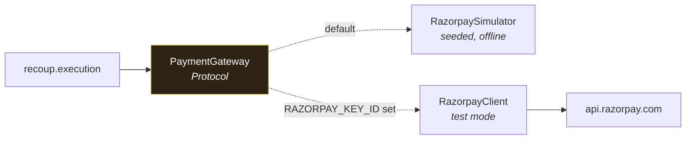

# Razorpay Integration

| Field | Value |
|---|---|
| Document version | 1.0 |
| Status | Approved for build |
| Mode | **Test mode only** — enforced at startup |
| Related | [ARCHITECTURE §8](ARCHITECTURE.md) · [DOMAIN-MODEL](DOMAIN-MODEL.md) |

---

## 1. Integration stance

Razorpay is the data plane. Recoup observes it through webhooks and acts on it
through APIs. It never holds funds and never moves money by any other path.

Everything sits behind one interface with two implementations, so the demo and
the benchmark run with **no credentials and no network**, and the same code path
drives live test mode when keys are present.



### 1.1 Test-mode enforcement

```python
if not settings.razorpay_key_id.startswith("rzp_test_"):
    raise ConfigurationError(
        "Recoup refuses non-test Razorpay keys. This system executes "
        "payment retries and customer contact; it must never run against "
        "live merchant data."
    )
```

Startup fails hard. This is a deliberate refusal rather than a warning: a system
that retries charges and messages customers should be structurally incapable of
pointing at production by accident.

## 2. The interface

```python
class PaymentGateway(Protocol):
    # Reads
    async def fetch_payment(self, payment_id: str) -> Payment: ...
    async def fetch_order(self, order_id: str) -> Order: ...
    async def fetch_subscription(self, sub_id: str) -> Subscription: ...
    async def fetch_invoice(self, invoice_id: str) -> Invoice: ...
    async def list_payments(self, q: PaymentQuery) -> Page[Payment]: ...

    # Recovery actions
    async def retry_payment(self, req: RetryRequest) -> PaymentResult: ...
    async def present_mandate(self, req: MandateDebitRequest) -> DebitResult: ...
    async def create_payment_link(self, req: LinkRequest) -> PaymentLink: ...
    async def cancel_payment_link(self, link_id: str) -> None: ...

    # Subscription lifecycle
    async def resume_subscription(self, sub_id: str) -> Subscription: ...
    async def create_auth_link(self, req: AuthLinkRequest) -> AuthLink: ...
```

Both implementations run the same **conformance suite** (TR-63). A simulator that
diverges from the live client's contract would let us pass tests against fiction.

## 3. Razorpay APIs used

| Recoup capability | Razorpay API | Purpose |
|---|---|---|
| Payment failure ingestion | Webhooks: `payment.failed` | L1 signal |
| Payment detail + decline reason | `GET /v1/payments/{id}` | `error_code`, `error_description`, `error_source`, `error_step`, `error_reason` |
| Retry a failed payment | Orders + Payment Links | Razorpay has no "retry this payment" primitive — recovery is a new attempt against the same order, or a fresh link |
| Checkout abandonment | `GET /v1/orders` with status filter | Orders created without a captured payment inside the window → L4 |
| Subscription failure | Webhooks: `subscription.charged` (failed), `subscription.pending`, `subscription.halted` | L2, L3 |
| Mandate re-presentation | Subscriptions API | Re-attempt a failed cycle within budget |
| Re-authorisation | Subscription auth link | `mandate_revoked` recovery |
| Recovery instrument | `POST /v1/payment_links` | The primary customer-facing action |
| B2B receivables | Invoices API + Smart Collect virtual accounts | L5, with auto-reconciliation |
| Attribution | Webhooks: `order.paid`, `payment.captured` | Match inbound payment to case |
| Hard stop | Webhooks: `payment.dispute.created` | Stopping rule R2 |
| Settlement view | Settlements API | Finance console reconciliation |

### 3.1 The retry subtlety

Razorpay does not expose "retry payment X". A failed payment is terminal. Recovery
means one of:

1. **A new payment attempt against the same order** — valid while the order is
   `created`/`attempted`, appropriate for `network_timeout` and transient issuer
   failures where the customer is still present.
2. **A fresh payment link** — a new order, sent to the customer. Appropriate for
   `insufficient_funds` where the retry happens hours or days later.
3. **A mandate re-presentation** — for subscriptions, re-attempting the cycle
   charge within the rail's re-presentation budget.

The playbook chooses based on root cause and elapsed time. Getting this wrong is
a common integration error — issuing a fresh link for a customer still sitting on
the checkout page is a worse experience than retrying the order.

## 4. Webhooks

### 4.1 Subscribed events

```
payment.failed              payment.captured           payment.authorized
order.paid                  payment_link.paid          payment_link.expired
subscription.charged        subscription.pending       subscription.halted
subscription.cancelled      subscription.completed
invoice.paid                invoice.expired
payment.dispute.created     refund.created
```

### 4.2 Verification

```python
expected = hmac.new(
    settings.razorpay_webhook_secret.encode(),
    raw_body,                       # raw bytes, before any parsing
    hashlib.sha256,
).hexdigest()

if not hmac.compare_digest(expected, request.headers["X-Razorpay-Signature"]):
    raise HTTPException(400, "invalid signature")
```

Two details that are easy to get wrong and both matter:

- **Raw body, not re-serialised JSON.** A framework that parses and re-dumps
  changes byte order and key spacing; the HMAC then never matches. The endpoint
  reads `await request.body()` before touching the parser.
- **`compare_digest`, not `==`.** String equality short-circuits on first
  mismatch and leaks signature bytes through timing.

### 4.3 Delivery semantics

Razorpay retries webhooks it considers failed, so delivery is **at-least-once and
unordered**. The handler is built for that:

| Reality | Handling |
|---|---|
| Duplicates | Unique constraint on `provider_event_id`, `ON CONFLICT DO NOTHING` |
| Out-of-order arrival | Events carry timestamps; state transitions are guarded, so a late `payment.failed` cannot reopen a case a `payment.captured` already closed |
| Slow handler ⇒ redelivery | Ack after durable raw write, before interpretation (TR-2) |
| Unknown event type | Stored and flagged, never dropped |

## 5. Decline code mapping

Razorpay returns `error_code`, `error_description`, `error_source`, `error_step`,
and `error_reason`. Recoup normalises `error_reason` into the canonical taxonomy
in [DOMAIN-MODEL §2.3](DOMAIN-MODEL.md), preserving the raw values for forensics.

Representative mappings:

| Razorpay `error_reason` | Canonical category | Retryable |
|---|---|---|
| `payment_failed_due_to_insufficient_funds` | `INSUFFICIENT_FUNDS` | yes |
| `issuer_down` / `gateway_technical_error` | `ISSUER_DOWN` | yes |
| `payment_timed_out` | `NETWORK_TIMEOUT` | yes |
| `card_expired` | `EXPIRED_INSTRUMENT` | **no** |
| `invalid_vpa` / `invalid_card_number` | `INVALID_INSTRUMENT` | **no** |
| `mandate_revoked` / `mandate_cancelled` | `MANDATE_REVOKED` | **no** |
| `payment_declined_by_issuer` | `ISSUER_DECLINED` | weakly |
| `payment_failed_due_to_risk` | `RISK_BLOCKED` | **never** |
| *unmapped* | `UNKNOWN` | **no** — escalates to human review |

The mapping lives in `config/decline_taxonomy.yaml`, versioned and reviewable as
data. An unmapped code is conservative by default: not retryable, escalate. That
is the correct behaviour for a system acting on a customer's money — an unknown
failure is a gap in our knowledge, not permission to experiment.

## 6. The simulator

Not a mock. A model of the phenomena the diagnosis engine claims to detect.

If the simulator emitted uniform random failures, the diagnosis engine could
"detect an issuer outage" that was never simulated, and the benchmark would be
measuring nothing. It therefore models:

| Phenomenon | Modelled behaviour |
|---|---|
| **Issuer outages** | Correlated failure bursts on one issuer for a sampled duration. This is what L6 detection and hypothesis ranking exist to find. |
| **Salary-cycle effects** | `insufficient_funds` probability varies by day of month, peaking pre-payday. This is what the retry-timing bandit exists to exploit. |
| **Time-of-day success rates** | Diurnal variation, lower overnight. |
| **Mandate budgets** | Finite re-presentations per cycle, decremented on attempt. |
| **Instrument-specific rates** | UPI, cards, netbanking, and wallets fail at different rates for different reasons. |
| **Customer payment propensity** | A latent per-customer willingness to pay, so **some cases recover with no intervention** — which is precisely why the control arm exists. |
| **Intervention response** | Payment-link click-through and conversion vary by channel, timing, and propensity. |
| **Network faults** | Timeouts, 5xx, and 429s, so retry and circuit-breaker logic is exercised. |

Every parameter is in `config/simulator.yaml` and **published in the benchmark
report**. A reviewer can read exactly what world the numbers came from — that is
what makes a synthetic result honest rather than unfalsifiable.

### 6.1 Ground truth

The simulator records the true cause of every failure. Diagnosis accuracy in
[METRICS §5](../01-product/METRICS-AND-KPIS.md) is measured against it.

The ground-truth table is **write-only from the simulator's side and read-only
from the evaluator's**, and no pipeline component can read it. A test asserts no
module outside `bench.evaluation` imports it — otherwise the diagnosis engine
could accidentally be graded on information it had access to.

### 6.2 Determinism

Seeded from the run seed, threaded explicitly through every call. No global RNG
(TR-38). Same seed in, byte-identical results out — verified by a test that runs
two independent benchmarks and diffs the summaries.

## 7. Rate limits and resilience

| Concern | Handling |
|---|---|
| Rate limiting | Token bucket per endpoint class, sized below documented limits. 429 → exponential backoff with jitter, surfaced as `DEFER`. |
| 5xx | Retry up to 3 times with backoff. |
| 4xx | **Never retried.** A 400 will be 400 again; retrying wastes budget and obscures the bug. |
| Circuit breaker | Opens after 5 consecutive failures, half-opens after 30s. Open circuit ⇒ `DEFER`, not `DENY` — a provider being down is a timing problem, and denying would drop recoverable cases. |
| Idempotency | Every mutating call carries `X-Razorpay-Idempotency-Key` where supported; Recoup's own key check in Redis covers the rest. |
| Timeouts | 10s connect, 30s read. Explicit on every call (TR-51). |

## 8. Local development

```bash
# Default — simulator, no credentials
make demo

# Live test mode
cp .env.example .env
# set RAZORPAY_KEY_ID=rzp_test_..., RAZORPAY_KEY_SECRET=..., RAZORPAY_WEBHOOK_SECRET=...
make demo GATEWAY=live
```

Webhooks in development are tunnelled (`make tunnel` wraps ngrok) and the public
URL registered in the Razorpay dashboard. Documented in
[`docs/03-delivery/PHASE-05-live-integration.md`](../03-delivery/PHASE-05-live-integration.md).

## 9. What is real and what is simulated

Stated plainly here so the README, the pitch, and the docs all say the same thing:

| Component | Live test mode | Simulator (default) |
|---|---|---|
| Payment retries | **Real** Razorpay test-mode calls | Simulated |
| Payment links | **Real**, openable in a browser | Simulated |
| Subscriptions and mandates | **Real** test-mode objects | Simulated |
| Webhooks | **Real** deliveries from Razorpay | Injected |
| SMS / WhatsApp / email delivery | **Simulated** | Simulated |
| Voice calls | **Simulated** | Simulated |

Messaging transport is simulated in both modes. The channel adapters, cost
accounting, consent enforcement, and compliance validation are real code doing
real work — only the final network hop to a telecom provider is stubbed.

Recoup does not send real SMS, and no document, demo, or pitch claims it does.
