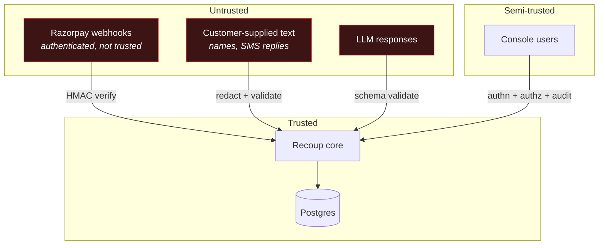

# Security and Threat Model

| Field | Value |
|---|---|
| Document version | 1.0 |
| Scope | Test-mode system handling synthetic and sandbox data |
| Related | [POLICY-ENGINE](POLICY-ENGINE.md) · [DATA-MODEL §4](DATA-MODEL.md) · [AI-DESIGN §10](AI-DESIGN.md) |

Recoup retries charges and contacts customers about money. The blast radius of a
compromise is financial and reputational, so the threat model is written for what
this system *would* be in production, not only what it is in test mode.

---

## 1. Assets

| Asset | Sensitivity | Impact if compromised |
|---|---|---|
| Razorpay API credentials | **Critical** | Attacker acts as the merchant |
| Customer PII (phone, email, name) | **High** | Privacy breach, regulatory exposure |
| Consent ledger | **High** | Contacting an opted-out customer is a compliance violation |
| Audit log | **High** | Tampering destroys the ability to prove what happened |
| Policy configuration | **High** | Weakened thresholds enable harassment or overspend |
| Mandate references | **Medium** | Enables unauthorised debit attempts |
| Benchmark data | Low | Synthetic |

## 2. Trust boundaries

The important one: **LLM responses are untrusted input.** They are schema-validated
and their evidence references are checked for existence before use — the same
treatment as data arriving from the internet, because that is what they are.

## 3. Threats and mitigations

### T1 — Forged webhook triggers false recovery actions
**Impact:** Attacker fabricates `payment.failed` events, causing retries and
messages to real customers.
**Mitigations:** HMAC-SHA256 over the raw body with `hmac.compare_digest`;
verification before parsing; the raw body read before the JSON parser touches it
(a re-serialised body produces a different digest and would break verification
in a way that invites developers to "fix" it by weakening the check).
**Residual:** Webhook secret compromise. Mitigated by rotation support and by the
policy gate bounding what any single forged event can cause.

### T2 — Credential leakage
**Impact:** Full merchant account access.
**Mitigations:** No credentials in source; gitleaks in pre-commit and CI;
environment-only configuration; `rzp_test_` prefix enforced at startup (TR-49);
secrets never logged — the settings object has a `__repr__` that masks them, so
an accidental `log.info(settings)` cannot leak.
**Residual:** Local `.env` on a developer machine. `.gitignore`d; documented.

### T3 — Prompt injection via customer-supplied text
**Impact:** Attacker manipulates diagnosis or generated copy.
**Mitigations:** Layered, described in [AI-DESIGN §10](AI-DESIGN.md).
The structural one: the model returns a **closed enum** consumed by a dictionary
lookup, so there is no instruction channel to hijack. PII (including name fields,
the most likely injection vector) never reaches the model. SMS replies are parsed
by keyword matching, not by a model. Generated copy passes a deterministic
validator.
**Residual:** Degraded diagnosis quality on a poisoned cohort. Bounded — the
policy gate is unaffected, so no illegal action can result.

### T4 — Audit log tampering
**Impact:** History rewritten; the system's central claim becomes unverifiable.
**Mitigations:** Database triggers rejecting `UPDATE`/`DELETE`
([DATA-MODEL §3.1](DATA-MODEL.md)); hash chaining with `prev_hash`; gapless `seq`
under a unique constraint; `chain_valid` computed on every timeline read;
`recoup audit verify` for offline checking.
**Residual:** An attacker with `ALTER TABLE` rights could drop the trigger — but
that is a schema change, and the hash chain still breaks. Detection survives.

### T5 — Runaway action loop
**Impact:** Thousands of retries or messages to one customer — the failure mode
that turns a recovery tool into a harassment engine.
**Mitigations:** Frequency caps counted **across all cases** for a customer, not
per case (the single most important detail here); per-case cost ceilings; global
daily spend cap; `max_attempts` per playbook; the kill switch; property test P7
asserting the cap holds under any input sequence.
**Residual:** A bug in the cap accounting. Covered by property tests and a
database-level `cost_within_ceiling` CHECK as defence in depth.

### T6 — Race condition double-charges a customer
**Impact:** Money taken twice. The worst possible outcome for this system.
**Mitigations:** Derived idempotency key `sha256(case_id|step_id|attempt)` with
Redis `SET NX`; `SELECT ... FOR UPDATE SKIP LOCKED` claiming; atomic mandate
budget reservation before the gateway call; concurrency tests with parallel
workers against one mandate.
**Residual:** Redis unavailability. The database outbox claim remains a second
barrier — both would have to fail simultaneously.

### T7 — Compliance bypass
**Impact:** Contacting an opted-out customer, or messaging during quiet hours.
**Mitigations:** The policy gate cannot import a model (import-linter contract);
executor asserts an `ALLOW` for the same attempt; consent evaluated at the
action's `due_at` from an append-only ledger; property tests P3, P4, P6.
**Residual:** A policy misconfiguration. Mitigated by config being a reviewed PR
with a version bump, and by the policy config hash being recorded on every
decision so historical decisions replay against the rules actually in force.

### T8 — PII exposure to third parties
**Impact:** Customer data in Anthropic's logs, or in ours.
**Mitigations:** PII in a separate table behind an access-logged repository;
domain objects carry references only; a redaction layer that asserts on its own
output before every model call; encrypted at rest; masked in audit payloads;
structured logging with a PII filter.
**Residual:** A new code path bypassing the redactor. Caught by the redactor's
assertion, which raises rather than warns.

### T9 — Console session hijack
**Impact:** Attacker approves high-value actions or clears the kill switch.
**Mitigations:** `HttpOnly`, `Secure`, `SameSite=Lax` cookies; CSRF tokens on
mutations; short session lifetime; role separation; every action audited with the
actor.
**Residual:** Standard web session risk.

### T10 — Denial of service via webhook flood
**Impact:** Legitimate events delayed.
**Mitigations:** Rate limiting; fast ack before interpretation; async processing;
bounded worker concurrency.
**Residual:** Sustained volumetric attack — out of scope at this deployment tier.

## 4. Secure development practices

| Practice | Enforcement |
|---|---|
| Secret scanning | gitleaks, pre-commit + CI |
| Dependency audit | pip-audit, npm audit — CI fails on high/critical |
| Container scanning | trivy on built images |
| Static analysis | ruff security rules, bandit |
| Type safety | mypy strict, tsc strict |
| Pinned dependencies | Hash-pinned lockfiles |
| Non-root containers | Enforced in Dockerfile |
| No `eval`/`exec` | Lint rule |
| Explicit timeouts | Lint rule — an unbounded HTTP call fails the build |

## 5. Data protection

| Control | Implementation |
|---|---|
| PII at rest | Encrypted (`*_enc` columns), versioned keys |
| PII in transit | TLS everywhere |
| PII in logs | structlog processor strips known PII keys |
| PII in audit | Masked at write time |
| PII to LLM | **Never** — enforced by the redactor's assertion |
| Right to erasure | `customer_pii` deleted; audit chain survives with masked references |
| Retention | Per [DATA-MODEL §7](DATA-MODEL.md) |

The erasure design deserves a note: because audit payloads store masked values
rather than raw PII, deleting a customer's personal data leaves the hash chain
intact and verifiable. An immutable audit log and a right-to-erasure obligation
are usually presented as in tension; separating the two stores resolves it.

## 6. What is explicitly out of scope

Stated so the boundary is clear rather than implied:

- **PCI DSS.** Recoup never sees, stores, or transmits card data — only Razorpay
  tokens and last-4. It is out of PCI scope by design.
- **Production hardening.** No WAF, no DDoS protection, no HSM. This is a
  test-mode system.
- **Multi-tenancy.** Single-merchant. Tenant isolation is not implemented and is
  not claimed.
- **Formal pen test.** Not conducted.

## 7. Incident response

If the system misbehaves:

1. **Trip the kill switch** (`POST /api/v1/kill-switch`). All execution halts
   within one scheduler tick; no state is lost.
2. **Assess** via the audit log — every action and denial is recorded.
3. **Verify integrity** with `recoup audit verify`.
4. **Remediate**, then clear the switch with a recorded reason.

The kill switch is deliberately the *first* step and deliberately the only
runtime-mutable control. Stopping is always safe; that is the property worth
designing for.
