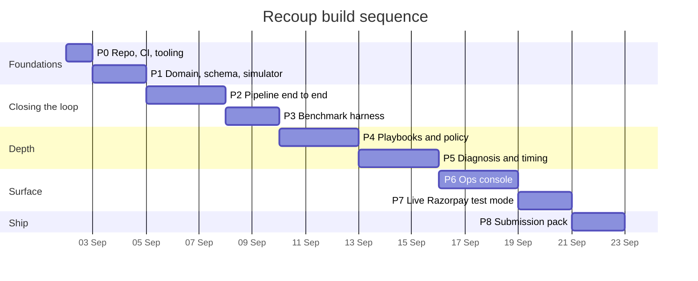
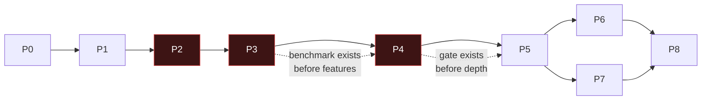

# Roadmap

| Field | Value |
|---|---|
| Document version | 1.0 |
| Start | 2 September 2026 |
| Submission milestone | 5 September 2026 (M0–M2 + submission pack) |
| Full build | ~3 weeks |
| Related | [PRD §9](../01-product/PRD.md) · [GIT-WORKFLOW](GIT-WORKFLOW.md) |

---

## 1. Sequencing principle

**The measurement harness ships before the features it measures.**

The usual instinct is to build the recovery logic first and add benchmarking at
the end. That produces a system whose numbers cannot be trusted, because the
measurement was designed after the thing it measures and inherits its
assumptions.

So the order is: make one case flow end to end (Phase 2), then immediately build
the three-arm benchmark (Phase 3), and only then add playbooks and policy depth
(Phase 4). Every subsequent feature is therefore measurable from the moment it
exists, and a feature that does not move the incremental number is visible as
such rather than assumed to help.

The second ordering rule: **the policy gate exists before the executor can act.**
There is never a commit in this repo's history where an action could execute
without passing a gate. That is easy to guarantee by construction and impossible
to retrofit convincingly.

## 2. Phase overview

| Phase | Name | Ships | Doc |
|---|---|---|---|
| **P0** | Foundations | Repo, CI, tooling, compose stack | [PHASE-00](PHASE-00-foundations.md) |
| **P1** | Domain core | Domain model, migrations, simulator | [PHASE-01](PHASE-01-domain-core.md) |
| **P2** | Closed loop | Ingest → detect → diagnose → gate → execute → attribute | [PHASE-02](PHASE-02-closed-loop.md) |
| **P3** | Measurement | Cohort generator, three arms, report | [PHASE-03](PHASE-03-measurement.md) |
| **P4** | Governance | Full rule set, playbooks, kill switch, approvals | [PHASE-04](PHASE-04-governance.md) |
| **P5** | Intelligence | Slice diagnosis, LLM ranking, timing bandit | [PHASE-05](PHASE-05-intelligence.md) |
| **P6** | Console | Next.js ops UI | [PHASE-06](PHASE-06-console.md) |
| **P7** | Live integration | Razorpay test mode behind the same adapter | [PHASE-07](PHASE-07-live-integration.md) |
| **P8** | Submission | README, video, failure log, clean-clone verification | [PHASE-08](PHASE-08-submission.md) |

## 3. The 5 September checkpoint

The buildathon form is due 5 September. Three days from start, so the submission
is a **checkpoint on a longer build**, not the end of it.

**Must be true by 5 September:**

| | Requirement |
|---|---|
| ✅ | `make demo` works on a clean clone with no credentials |
| ✅ | A benchmark run produces an incremental-recovery number with a CI |
| ✅ | Any case can be opened and its full audit trail read, including denials |
| ✅ | The policy gate is real, tested, and provably not bypassable |
| ✅ | The repo reads as engineered: CI green, typed, tested, documented |
| ✅ | `FAILURE-LOG.md` is populated with real failures from the build |
| ✅ | 5-minute video recorded |

That means **P0–P4 complete, P5 partial** by the 5th. The console (P6) and live
Razorpay integration (P7) are explicitly *after* the submission — a reviewer who
clones the repo cares far more that the loop is measured and governed than that
there is a pretty dashboard.

This is a deliberate trade. If time compresses further, the cut order is:

1. Cut P6 console → ship a static HTML benchmark report instead
2. Cut P7 live integration → simulator only, stated plainly
3. Cut L4/L5 leak classes → L1–L3 only, stated plainly
4. **Never cut:** the policy gate, the audit chain, the holdout arm, the exception
   list

Items in (4) are the product. Everything else is surface area.

## 4. Phase detail

### P0 — Foundations *(1 day)*

Repo hygiene, CI pipeline, `docker compose` stack, tooling configured and
enforced. No product code.

**Exit:** CI green on an empty test suite. `docker compose up` starts Postgres,
Redis, and a health-checkable API. Every quality gate in
[ENGINEERING-STANDARDS](ENGINEERING-STANDARDS.md) is wired and failing the build
when violated.

### P1 — Domain core *(2 days)*

The pure domain package, the database schema with its constraints and triggers,
and the seeded simulator.

**Exit:** `Money` cannot be constructed from a float. The case state machine
rejects illegal transitions. The audit trigger rejects `UPDATE`. The simulator
produces byte-identical output for a given seed, twice.

### P2 — Closed loop *(3 days)*

One case flows the entire pipeline in dry-run: webhook → signal → case →
(stub diagnosis) → plan → policy gate → executor → attribution → outcome, with a
complete audit chain.

Diagnosis here is deliberately a stub returning the decline category — the *shape*
of the pipeline is what P2 proves. Real diagnosis is P5.

**Exit:** An end-to-end test drives one case from a webhook fixture to
`RECOVERED` and asserts the audit chain verifies. No action can execute without
an `ALLOW`.

### P3 — Measurement *(2 days)*

The cohort generator, arm assignment, the three-arm runner, and the report
writer.

**Exit:** `make bench SEED=42` runs 2,000 cases in under 10 minutes and emits a
report with incremental recovery, a confidence interval, cost per rupee, and a
full exception list. Two runs at the same seed produce byte-identical summaries.

### P4 — Governance *(3 days)*

All eleven policy rules, the stopping rules, the compliance validator, the
playbook registry, the kill switch, and the approval queue. Property tests P1–P9.

**Exit:** All nine property invariants hold. The adversarial injection suite
passes with no behaviour change. Tripping the kill switch mid-benchmark halts
execution within one tick and loses nothing.

### P5 — Intelligence *(3 days)*

Slice aggregation, significance testing, LLM hypothesis ranking with fallback,
the redaction layer, and the retry-timing bandit.

**Exit:** Diagnosis accuracy measured against simulator ground truth. The
ablation table is populated. `make test-no-llm` passes. The bandit beats the
fixed schedule on mandate budget efficiency, **or the report says it did not**.

### P6 — Console *(3 days)*

Next.js ops UI: dashboard, case timeline with denials, approval queue, kill
switch, compliance view.

**Exit:** A reviewer can drive the entire demo from the browser without touching
a terminal.

### P7 — Live integration *(2 days)*

`RazorpayClient` behind the existing interface, webhook registration, the
gateway conformance suite passing against both implementations.

**Exit:** With test-mode keys in `.env`, the same pipeline drives real Razorpay
test-mode payments, subscriptions, and payment links. Without them, the simulator
runs unchanged.

### P8 — Submission *(2 days)*

README, architecture summary, 5-minute video, failure log finalised, clean-clone
verification by someone who has not seen the repo.

**Exit:** A third party clones, runs `make demo`, and reaches a report with no
help.

## 5. Dependencies

P2, P3, and P4 are the critical path. P6 and P7 are parallelisable and both are
post-submission.

## 6. Risk checkpoints

| After | Check | If it fails |
|---|---|---|
| P1 | Simulator determinism verified twice | Stop. Every downstream number depends on it. |
| P2 | Audit chain verifies on a full case | Stop. The audit trail is the product's core claim. |
| P3 | Two identical seeds produce identical summaries | Stop. A non-reproducible benchmark is not a benchmark. |
| P3 | Baseline arm beats control | Investigate the generator — if a retry cron does nothing, the simulated world is unrealistic |
| P4 | All nine property tests pass | Stop. These are the compliance guarantees. |
| P5 | Treatment beats baseline | **Do not stop.** Report it honestly and investigate. A negative result reported well is worth more than a positive result fabricated. |

The P5 row is the one that matters most. The temptation at that point will be to
tune the simulator until the numbers look good. That is the exact failure this
project's measurement doctrine exists to prevent, and doing it would invalidate
everything else.

## 7. Tracking

Work is tracked as GitHub issues, labelled by phase, one PR per issue, per
[GIT-WORKFLOW](GIT-WORKFLOW.md). Each phase doc carries its own task list with
acceptance criteria and the intended PR breakdown.
